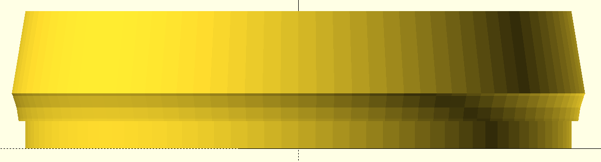
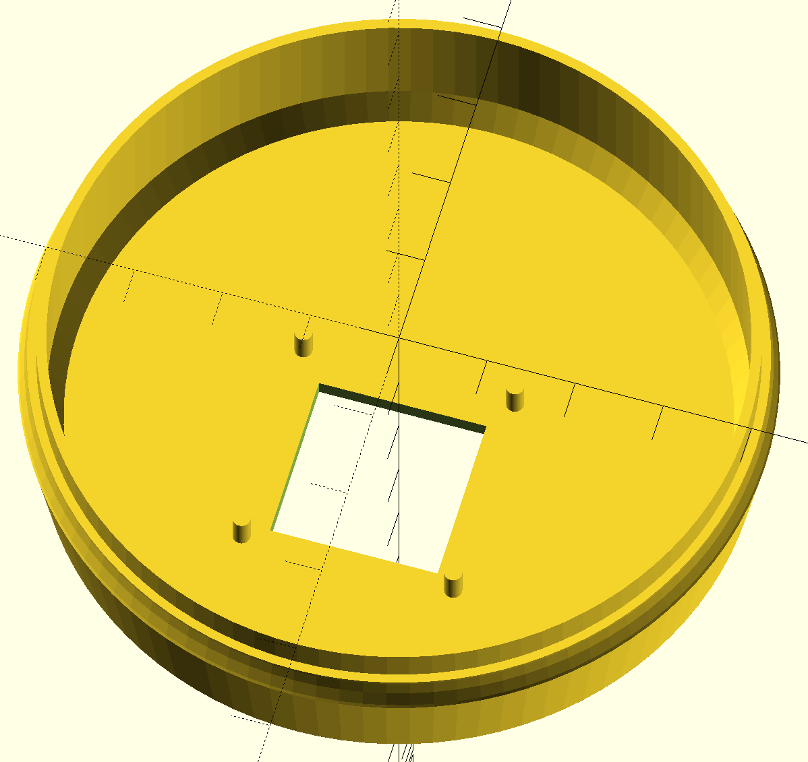
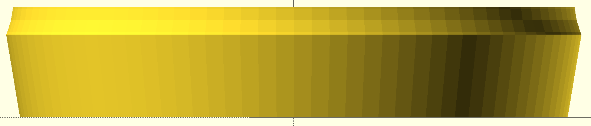
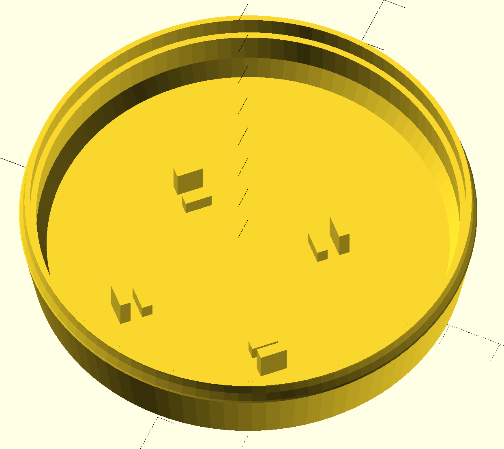

Joystick case for OC6000 1st generation game console
====================================================

The OC6000 is a french 1st generation game console made by Société Occitane
d’Électronique.

The console I had in hands had one joystick case broken. Since the console has
2 joysticks, it was easy to get measures from the other.

The case is simple enough for a first drawing while not completely trivial.

How I did it
------------

I did it using:

- **Inkscape** for SVG generation.
- **svgtodxf** for converting the SVG to a DXF file.
- **OpenSCAD** for importing the DXF files, saving the SCAD files and STL files
  generation.
- **Cura** (by Dagoma) for g-code generation from the STL files.

I followed these steps:

- Inkscape is used to draw the box’s profile,
- the profiles are then extruded by rotation in OpenSCAD,
- small parts and hole are finally added by coding in OpenSCAD.

Pictures
--------

### Upper part

### Lower part

